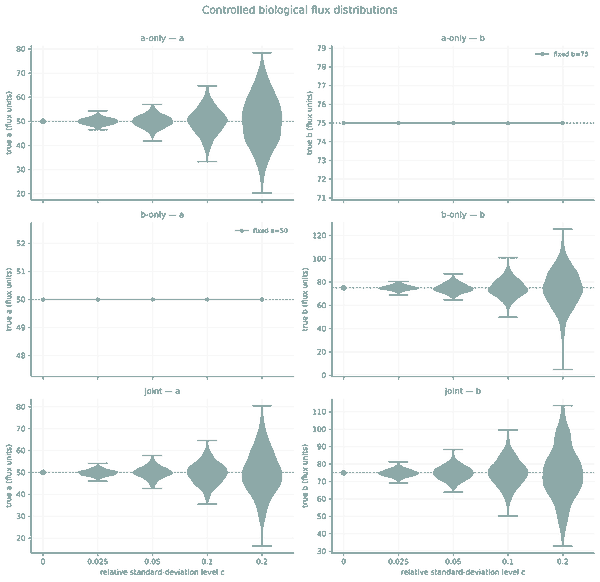
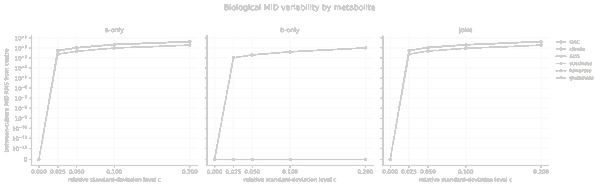

# Metabolism Testing

**Can network coupled isotope observations distinguish metabolic states or metabolic classes reliably even when the underlying flux state cannot be uniquely estimated?**

This repository develops that question from literature review to mathematical formulation and executable simulation. It combines a reproducible methodological audit of stable isotope metabolic tracing, explicit definitions of the observable data and uncertainty structure, statistical decision problems, and a scoped simulation framework for studying mass isotopologue distributions (MIDs) under controlled metabolic variation (https://arxiv.org/abs/2608.28068).

## From flux states to observable isotope distributions

The central distinction is between a latent metabolic state and what an isotope tracing experiment actually observes. A flux state is propagated through a metabolic and isotope model to a joint collection of MIDs. Biological and technical variation therefore induce families of distributions over observable isotope data rather than a single uniquely recoverable flux vector.

*Controlled synthetic variation in the latent flux coordinates used in the Control 0 benchmark. These distributions are simulation inputs, not fitted biological population models.*

*The same controlled flux variation expressed in observable MID space. Different latent directions produce different metabolite level isotope responses, motivating tests formulated directly on observable distributions.*

The methodological question is whether these observable distribution families can be discriminated with controlled finite sample error, including settings where conventional flux estimation is nonidentifiable or unstable.

## Current scientific object

The working definition used throughout the project is

> A metabolic class is a family of joint probability distributions over observable isotope data generated by a specified biological state and experimental protocol, while admitting explicitly defined biological, batch, preparation, processing and instrumental variation.

The primary observations are network coupled mass isotopologue distributions together with their registered experimental lineage. Fitted fluxes are downstream estimators, not the primary data object. Flux estimation and observable distribution discrimination are therefore treated as distinct questions.

Case specific protocol instantiations currently include multiple myeloma and SDH-b chromaffin cell examples. They are possible applications and do not predetermine the literature review or mathematical conclusions.

## Simulation framework

[`simulation/`](simulation/) is a scoped snapshot of the FluxEMU research code exported from immutable source commit [`711ead67cd739d0e13c16cde34d9d7113b83043d`](https://github.com/esig626/fluxemu-prototype/commit/711ead67cd739d0e13c16cde34d9d7113b83043d). The canonical development history remains [`esig626/fluxemu-prototype`](https://github.com/esig626/fluxemu-prototype).

FluxEMU is not an independent EMU numerical solver. It constructs metabolic and isotope model representations and delegates numerical EMU calculations to separately sourced `mfapy`. COBRApy supplies SBML handling and constraint based network operations.

The imported snapshot includes forward MID generation, product multinomial observation models, composite and minimax testing, Rényi and KL calculations, metabolic class discrimination, selected topology and measurement panel analyses, compact fixtures, documentation and focused tests. The exported package test suite completed with **185 tests passing** in the recorded environment. That is software level evidence only. It does not establish biological validation, complete reproducibility, novelty, or a uniform theorem.

## Repository map

- [`protocol/`](protocol/) contains the review questions, eligibility rules, search strategy, evidence schema and evidence boundary decisions.
- [`problem/`](problem/) defines the experimental pipeline, observation objects, metabolic classes, replication hierarchy, uncertainty structure, scientific decisions, source information gaps and candidate mathematical problems.
- [`analyses/`](analyses/) contains literature grounded methodological analyses and prior art assessments.
- [`synthesis/`](synthesis/) contains the cross literature taxonomy, candidate gap material, rejected novelty claims and comparison documents.
- [`simulation/`](simulation/) contains the scoped simulation and statistical testing snapshot, with provenance, compact fixtures and tests.
- [`audit/`](audit/) contains search logs, screening ledgers, decisions, raw search captures, citation checks, verification artefacts, deduplication records, red team material and other review provenance.
- [`sources/`](sources/) contains separately retained source PDFs.
- [`corpus/`](corpus/) is the canonical evidence table location. The current `corpus/papers.csv` remains flagged for recovery rather than reconstructed by guesswork.
- [`scripts/`](scripts/) contains preserved review, migration, validation and screening utilities.
- [`archive/`](archive/) contains historical migration snapshots and uploaded archival material retained for provenance.

## Suggested reading order

1. [`protocol/review_questions.md`](protocol/review_questions.md)
2. [`problem/experimental_event_map.md`](problem/experimental_event_map.md)
3. [`problem/metabolic_class_definition.md`](problem/metabolic_class_definition.md)
4. [`simulation/README.md`](simulation/README.md)
5. [`simulation/docs/STATISTICAL_SCOPE.md`](simulation/docs/STATISTICAL_SCOPE.md)
6. [`analyses/fixed_sample_composite_testing_foundations.md`](analyses/fixed_sample_composite_testing_foundations.md)
7. [`synthesis/method_taxonomy.md`](synthesis/method_taxonomy.md)
8. [`synthesis/candidate_gaps.md`](synthesis/candidate_gaps.md)
9. [`problem/candidate_mathematical_problems.md`](problem/candidate_mathematical_problems.md)
10. [`audit/README.md`](audit/README.md) for the provenance trail behind those conclusions

## Current status

The repository now contains both the literature and provenance programme and a scoped simulation snapshot for studying observable MID families and finite sample statistical discrimination.

The current work should not be read as an established novelty claim or a completed theorem. Finite simulation grids do not establish uniform guarantees. Generated R1 MIDs are generated evidence rather than raw biological observations. Fragments measured from the same culture are coupled observations rather than independent biological replicates. Complete biological validation and end to end reproducibility remain unestablished.

The active objective is to determine which methodological claims survive the evidence audit and which statistical guarantees, experiment design criteria or impossibility results can actually be justified.
